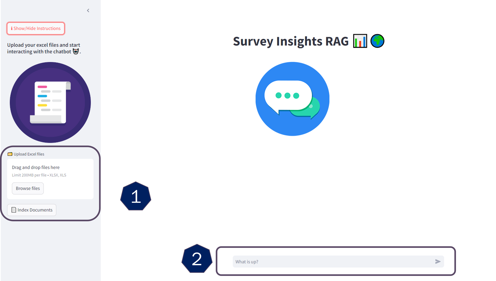

# SurveyRAG

# 🛠️ How it Works
### 📄 Step 1: Upload Your PDF Documents and Index Them
- **Upload Options:** Drag and drop your files or click on **'Browse Files'** to select them. (Maximum file size: **200MB**).
- **Start Indexing:** Click the **'📄 Index Document'** button to initiate the indexing process.

### 💬 Step 2: Ask Your Questions
Use the text box below to type your question. 📝



# 🌟 Technologies Utilized 🔧 
### 1. Haystack
)
Haystack is an open source framework for building production-ready LLM applications, retrieval-augmented generative pipelines and state-of-the-art search systems that work intelligently over large document collections. It lets you quickly try out the latest AI models while being flexible and easy to use. Our inspiring community of users and builders has helped shape Haystack into the modular, intuitive, complete framework it is today.
You can find more details about this framework here : https://haystack.deepset.ai/overview/intro

### 2. Qdrant


Qdrant  is a vector similarity search engine and vector database. It provides a production-ready service with a convenient API to store, search, and manage points—vectors with an additional payload Qdrant is tailored to extended filtering support. It makes it useful for all sorts of neural-network or semantic-based matching, faceted search, and other applications.
You can find more details about it : https://qdrant.tech/

### 3. Cohere 


Cohere is a machine learning company specializing in natural language processing (NLP) and text embedding technologies. Their platform offers tools that allow users to build, customize, and deploy models for tasks such as text generation, semantic search, and document classification. Cohere's API enables developers to harness the power of deep learning models to analyze and understand text data, **providing high-quality embeddings that capture the semantic meaning of words and phrases.** This facilitates various applications, including chatbots, recommendation systems, and data analysis, enhancing the ability to derive insights from unstructured text data.
You can find more details about it : https://cohere.com/about

### 4. Streamlit


Streamlit is an open-source framework designed for building and sharing interactive web applications specifically for machine learning and data science projects. It allows developers to create data-driven applications with minimal coding by using simple Python scripts. Streamlit's intuitive API facilitates the integration of various components, such as data visualizations, charts, and user input elements, making it easy to showcase insights and results in real-time. With its focus on rapid prototyping and ease of use, Streamlit enables data scientists and analysts to transform complex data workflows into engaging, user-friendly applications without requiring extensive web development expertise.
You can find more details about it : https://streamlit.io/

# 🚀 Getting Started
### Prerequisites
* Python 3.11 or above 🐍
* Groq API for inference, which is currently available for free in its beta version with rate limits. You can obtain your API key here after creating an account: [Groq API](https://medium.com/r/?url=https%3A%2F%2Fconsole.groq.com%2Fkeys).
* Additionally, you have the option to use Qdrant either locally or via Qdrant Cloud. Its API is also free to use. Access it here: [Qdrant Cloud](https://medium.com/r/?url=https%3A%2F%2Fcloud.qdrant.io%2Flogin).
* For embeddings, you can use the Cohere API. It offers a free tier and you can sign up and get your API key here: [Cohere API](https://medium.com/r/?url=https%3A%2F%2Fcohere.ai).
# 💻 Local Deployment
### 1. Clone the Repository
```bash
git clone https://github.com/Shreyas379/SurveyRAG.git
cd SurveyRAG
```
### 2. Add Environment Variables

* Create a `.env` file and add the following variables according to the credentials you obtained from the required platforms:

    ```plaintext
    COHERE_API_KEY=
    GROQ_API=
    GROQ_KEY=
    QDRANT_API=
    QDRANT_KEY=
    ```
    
### 3. Install Dependencies
Navigate to the local directory and install the necessary dependencies:
```bash
pip install -r requirements.txt
```

### 4. Running the App Locally
To run the app locally, execute the following command:

```bash
streamlit run main.py --environment local
```
You should now be able to access the app at http://localhost:8501 🌐.

# ☁️ Streamlit Cloud Deployment
### 1. Prepare Your Repository
Ensure that your code is pushed to a GitHub repository 📂.

### 2. Link with Streamlit Cloud
* Visit Streamlit Cloud and sign in.
* Connect your GitHub repository 🔗.
* Choose your repository and branch.

### 3. Environment Variables
* Go to the "Advanced settings" section of your app.
* In the "Secrets" section, input any sensitive information, such as API keys or other credentials.
* Make sure to add this variables according to the credentials you obtained from the required platforms.
```csharp
COHERE_API_KEY=""
GROQ_API=""
GROQ_KEY=""
QDRANT_API=""
QDRANT_KEY=""
```
Streamlit Cloud will:
* Install dependencies from requirements.txt 📦

🎉 You’re all set! Your app will now be live on Streamlit Cloud!


# **🔍 Advanced Technical Overview 📊**
# Step 1 : Survey Data Processing Pipeline

This step is designed to help clean and transform survey data from Excel files into a structured format that can be easily used for analysis. The process ensures that incomplete data (such as missing values) is handled correctly and the output is presented in a readable JSON format. The pipeline is useful for anyone dealing with large amounts of survey data that need to be organized and prepared for further insights.

## Overview

The goal of this step is to take raw survey data from Excel sheets, clean it, and convert it into a format that simplifies analysis. Survey data often has gaps, especially in demographic information, and this pipeline automatically fills those gaps while maintaining the integrity of the data. It also structures the survey questions and their possible answers into a clear, organized format.

### Key Features

- **Handling Missing Data:** The pipeline ensures that any missing information in the demographic fields is filled based on previous valid entries. For example, if a certain category is missing, it fills it with the last known category and appends a note that it is based on a percentage.
  
- **Renaming and Cleaning Columns:** It cleans up the column names and removes unnecessary ones, making the data easier to understand and work with.

- **Converting Data to JSON:** After processing, the data is converted into a JSON format where each survey question is mapped to its list of possible answers. This makes it easier to use the data in applications, for reporting, or even for feeding into other systems.

## How It Works

1. **Processing Excel Files:** The pipeline reads the uploaded Excel files, which contain survey data, and starts by focusing on the part of the data that needs attention—mainly demographic and response information.
  
2. **Filling in Missing Values:** Sometimes, demographic data like age groups or gender may have missing values. The pipeline fills in these gaps by using the last available valid data and marking it clearly to show it's estimated.

3. **Organizing the Data:** After cleaning up the demographic information, the pipeline looks at the survey questions and answer choices. It organizes these into a structure where every question is linked to its possible answers, ready for further analysis.

4. **Generating JSON Output:** Finally, the cleaned and organized data is turned into a structured format called JSON. This is widely used in many applications, making the survey data much easier to work with in different contexts, like reporting or building dashboards.

## Why This Matters

Survey data often comes with inconsistencies, especially when collected across diverse populations. This step ensures the data is clean and complete, saving time and effort in manual cleaning. By converting the data into a structured JSON format, it also becomes much easier to integrate into various tools and platforms, whether for visualization or further analysis.


# Step 2 : Indexing Pipeline

This component and pipeline are designed to process survey data in JSON format, converting each survey question and its associated choices into structured documents. The documents are then embedded using Cohere's embedding model and stored in a QdrantDocumentStore for future use in tasks such as semantic search or analysis.

## Components

### 1. `SurveyJSONToDocument`
Given that we have a custom treatment for the JSON records obtained from the initial step, and since Haystack does not support custom treatments directly but allows us to create our own components, we developed a custom component to process the survey data in JSON format. This component converts the survey data into a list of Haystack Document objects. Each survey includes questions and corresponding answer choices, which are transformed into text and stored as individual documents.

#### Output:
- `documents`: A list of Haystack `Document` objects created from the survey JSON.

#### Method: `run(json_results)`
The main method of this component that processes each survey JSON, where:
- **json_results**: A list of dictionaries representing survey data. Each dictionary contains questions (as keys) and their associated choices (as values).

##### Steps:
1. For each survey, it iterates through each question and its choices.
2. Joins the choices into a formatted text string.
3. Combines the question and its choices into a single text block.
4. Creates a Haystack `Document` object for each question-answer pair and stores it in a list of documents.
5. Returns a list of all generated `Document` objects.

### 2. `indexing_pipeline_builder(document_store, cohere_key)`
This function builds and returns a pipeline designed to process the JSON survey data, generate embeddings for the documents, and store them in a QdrantDocumentStore.

#### Parameters:
- **document_store**: A `QdrantDocumentStore` where the embedded documents will be stored.
- **cohere_key**: API key for the Cohere API, used to generate embeddings for the documents.

#### Steps:
1. **Initialize the pipeline**: Sets up the pipeline for processing the survey JSON data.
2. **Configure the embedder**: Uses the Cohere API to embed multilingual documents with the `embed-multilingual-v3.0` model.
3. **Set up the document writer**: Configures a document writer that stores the processed documents into the QdrantDocumentStore.
4. **Add components**:
   - Adds the `SurveyJSONToDocument` component to process survey JSON into documents.
   - Adds the Cohere embedder to generate embeddings for the documents.
   - Adds the document writer to store the embedded documents in the document store.
5. **Connect components**:
   - The output of the `SurveyJSONToDocument` component (list of documents) is passed to the embedder.
   - The embedded documents are passed to the document writer for storage.

#### Returns:
- A configured `Pipeline` object that processes survey data, generates embeddings, and stores them in a document store.


This approach simplifies the process of managing survey data, making it easier to use for advanced data retrieval and search applications.

# Step 3 : Retriever-Augmented Generation (RAG) Pipeline for Document-Based Q&A

This pipeline is designed for answering questions by retrieving relevant documents from a document store and using a language model (LLM) to generate responses based on the retrieved content. This approach, known as Retriever-Augmented Generation (RAG), ensures that the answers are grounded in the documents and do not rely on external knowledge.

## Function: `retriever_pipeline_builder`

This function constructs a RAG pipeline that:
1. Embeds the input query text.
2. Retrieves relevant documents from a `QdrantDocumentStore` based on the query embedding.
3. Constructs a prompt by combining the retrieved documents.
4. Generates a response using a large language model (LLM).

### Parameters:
- **document_store**: The `QdrantDocumentStore` where the documents are stored. This is used to retrieve relevant documents based on the query.
- **cohere_key**: The API key for Cohere, used to generate text embeddings for the input query.
- **groq_api**: The base URL for the Groq LLM service, which will be used to generate responses.
- **groq_key**: The API key for accessing the Groq LLM service.

### Steps of the Pipeline:
1. **Text Embedding**:
   - The input text (query) is embedded using Cohere's multilingual model (**embed-multilingual-v3.0**) to generate a query embedding.
   
2. **Document Retrieval**:
   - The `QdrantEmbeddingRetriever` retrieves the top 2 most relevant documents from the document store based on the query embedding.

3. **Prompt Building**:
   - A `PromptBuilder` constructs the final prompt by inserting the content of the retrieved documents into a predefined prompt template. The template provides specific guidelines for generating answers based solely on the retrieved documents.

4. **Response Generation**:
   - An OpenAI LLM model (Groq) generates the final answer by analyzing the prompt created by the `PromptBuilder`.

### Detailed Breakdown of Components:

#### 1. **OpenAIGenerator (LLM)**
   - This component uses the `Groq LLM` service (`llama3-8b-8192` model) to generate a response. The API key and URL for Groq are passed to this component.
   - It has generation settings like:
     - **Max Tokens**: Limits the length of the response to 512 tokens.
     - **Temperature**: Set to 0 for deterministic (non-random) responses.

#### 2. **Prompt Template**
   - The template guides the LLM on how to construct its response. Key instructions include:
     - Greeting: A simple, friendly message for greetings.
     - No Documents: A fallback response if no documents are retrieved.
     - Document-Based Answers: The response must be strictly based on the content of the retrieved documents.
     - Insufficient Information: If the documents don’t contain the necessary information, the model is instructed to state that it lacks the information.
     
   - The documents retrieved are passed into the template, along with the user’s query, to form a structured prompt.

#### 3. **CohereTextEmbedder**
   - This component is responsible for generating text embeddings using the Cohere API. These embeddings are used to query the document store and retrieve relevant content.

#### 4. **QdrantEmbeddingRetriever**
   - This component retrieves the top 2 most relevant documents from the `QdrantDocumentStore` based on the query embedding generated by the Cohere model.

### Pipeline Configuration:

The components are connected as follows:
- The query embedding generated by the `text_embedder` is passed to the `retriever` to retrieve documents.
- The retrieved documents are passed to the `prompt_builder` to create a prompt.
- The prompt is passed to the `llm` for response generation.

### Returns:
- **Pipeline**: The final RAG pipeline ready to embed the query, retrieve documents, and generate a document-based response using the LLM.


